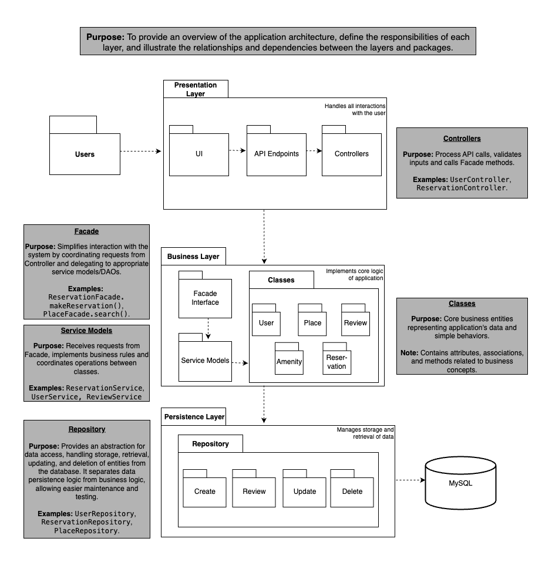
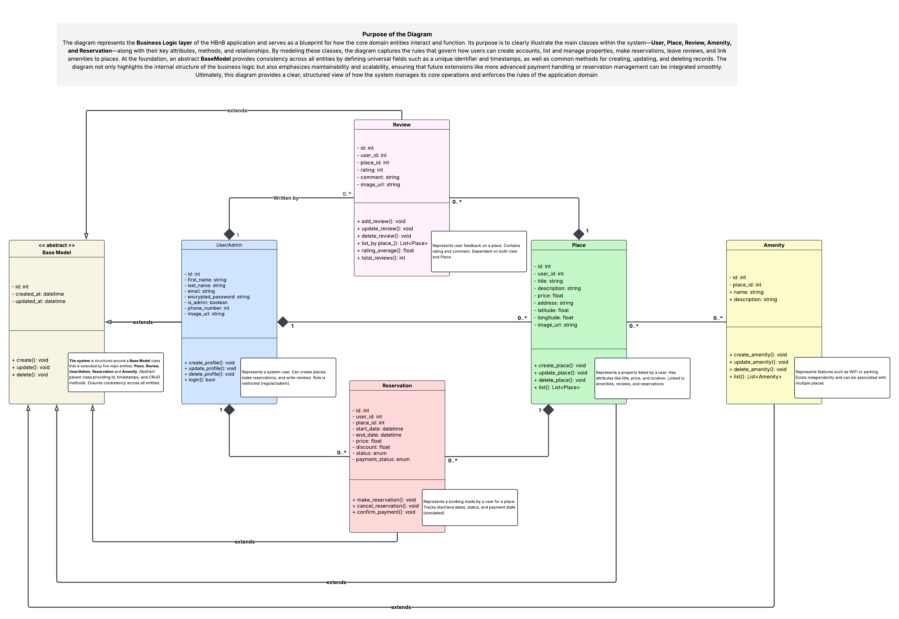

# Holberton School - HBnB Project

HBnB is a simplified Airbnb clone that allows users to manage accounts, list places, and handle reservations. The project demonstrates object-oriented design, software architecture, and persistence mechanisms.

## Table of Contents

- [Project Overview](#project-overview)
- [Architecture](#architecture)
  - [Presentation Layer](#presentation-layer)
  - [Business Logic](#business-logic-layer)
  - [Persistence Layer](#persistence-layer)
- [Task 0: Presentation Layer](#task-0-presentation-layer)
- [Task 1: Business Logic](#task-1-business-logic)
- [Task 2: Sequence Diagrams](#task-2-sequence-diagrams)
- [Authors](#authors)

## Project Overview

HBnB allows users to create accounts, list properties, and make reservations. The project is divided into clear layers to separate concerns, making it modular and maintainable.

## Architecture

### Presentation Layer

- Handles user input and output
- Interacts with the business logic layer
- Exposes API endpoints or CLI commands
- Validates user requests

### Business Logic Layer

- Implements core functionalities such as user management, place listing, and reservations
- Enforces application rules and workflows
- Coordinates between presentation and persistence layers
- Handles data transformations

### Persistence Layer

- Stores and retrieves data from a database or file system
- Manages object serialization and deserialization
- Provides abstraction to isolate business logic from storage details
- Ensures data consistency and integrity

## Task 0: Package Diagram

 
**Key Components:**

### Presentation Layer

Handles user interactions, translating actions into system operations and displaying results.

- **UI:** Web interface for browsing, searching, and managing accounts.
- **API Endpoints:** Define routes for accessing features.
- **Controllers:** Validate inputs, call the Facade, and return responses.

### Business Layer

Core logic connecting Presentation and Persistence layers.

- **Facade Interface:** Entry point coordinating requests and delegating to services.
- **Service Models:** Contain reusable business rules (e.g., `UserService`, `PlaceService`, `ReviewService`, `BookingService`).
- **Domain Classes:** Core entities like `User`, `Place`, `Review`, `Amenity`, and `Reservation`.

### Persistence Layer

Manages data storage and retrieval.

- **Repository:** Handles CRUD operations (Create, Read, Update, Delete) and encapsulates database logic.
- **Database (MySQL):** Stores all application data.

## Task 1: Business Logic

 
**Entities:**

#### `User`

- Auth info, profile, and image
- Fields: `id`, `email`, `encrypted_password`, `phone_number`, `image_url`, etc.

#### `Place`

- Property listing info
- Fields: `id`, `user_id`, `title`, `description`, `price`, `location`, etc.

#### `Reservation`

- Tracks booking info
- Fields: `id`, `user_id`, `place_id`, `start_date`, `end_date`, `status`, etc.

#### `Amenity`

- Features or services offered at a place
- Fields: `id`, `name`, `description`, etc.

#### `Review`

- Feedback for a place
- Fields: `id`, `user_id`, `place_id`, `rating`, `comment`, `created_at`, etc.

## Task 2: Sequence Diagrams

#### Key Participants
User → API (Presentation Layer) → Business Logic (Business Layer) → Database (Persistence Layer)

### User Registration & Login
#### Description
Handles the user account creation and authentication flow.

#### Flow Overview
1. **User** sends registration or login request.  
2. **API** receives and forwards the request to Business Logic.  
3. **Business Logic** validates:
   - Email uniqueness  
   - Password rules  
   - Credentials (for login)  
4. **Database** persists or retrieves user data.  
5. **Response:** Success (registration/login) or error message.

### Place Creation, Browsing & Booking
#### Description
Allows users to create listings, browse available properties, and make bookings.  
Only authenticated users can create and book places.

#### Flow Overview
**Place Creation**
1. API receives place details.  
2. Business Logic validates ownership and data.  
3. Repository saves the new place.  
4. Database confirms creation.

**Browsing/Search**
1. API forwards query to Business Logic.  
2. Business Logic retrieves properties.  
3. Database returns results.  

**Booking**
1. API sends booking request.  
2. Business Logic checks availability and payment.  
3. Database stores booking details.  
4. Confirmation returned to the user.

### Review Management
#### Description
Covers the complete lifecycle of reviews — creation, update, deletion, and retrieval.

#### Flow Overview
**Create Review**
- Validate rating and reference place.  
- Save review in repository.  
- Database confirms persistence.

**Update Review**
- Validate ownership and updated data.  
- Repository updates record.  
- Database confirms.

**Delete Review**
- Validate ownership.  
- Repository deletes record.  
- Database confirms deletion.

**List Reviews**
- API requests reviews.  
- Business Logic queries repository.  
- Database returns list to user.

### Fetching Amenities
#### Description
Handles retrieval of available amenities and property listings.

#### Flow Overview
1. User sends request to API.  
2. Business Logic abstracts and processes the query.  
3. Repository retrieves data.  
4. Database returns amenities or places.  
5. API sends results to the user.

## Authors

- Crystal Chiam
- Grǎce Kayembe
- Emily Chew
